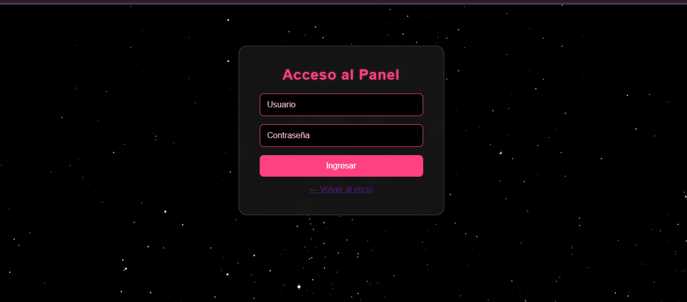
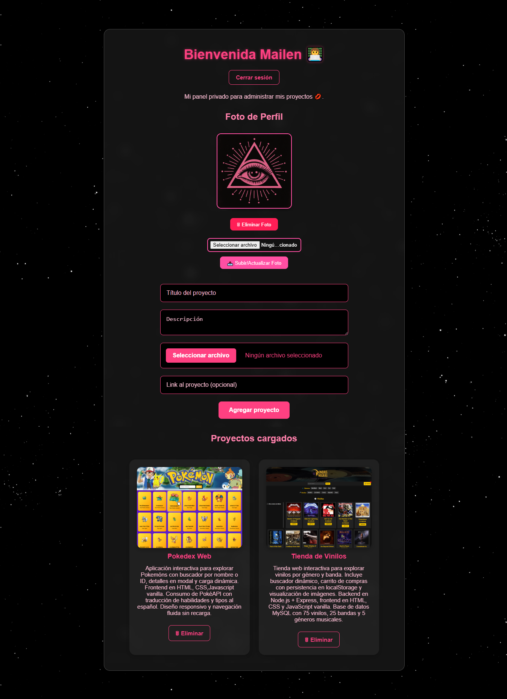

#  Portafolio Web – Mailen Ovejero ##  Visitá el sitio

👉 [-](-)  

Explorá los proyectos, el perfil y el CV en vivo. El panel admin está protegido por login.

---

Este proyecto es un portafolio web dinámico desarrollado con **Flask + MySQL**, donde se pueden visualizar proyectos, editar el perfil y gestionar contenido desde un panel privado. Pensado para reflejar profesionalismo visual en todos los dispositivos.

---

## Tecnologías utilizadas

- **Frontend:** HTML, CSS, SVG, responsive design  
- **Backend:** Flask, Python, MySQL  
- **Seguridad:** bcrypt, sesiones, variables de entorno  
- **Deploy-ready:** estructura limpia con `.env`, `.gitignore`, `requirements.txt`

---

##  Funcionalidades

-  Visualización de proyectos con imagen, descripción y link  
-  Login seguro con contraseña encriptada (bcrypt)  
-  Panel admin para agregar y eliminar proyectos  
-  Edición de foto de perfil  
-  Sección CV  
-  Protección de rutas: solo usuarios logueados acceden al panel

---

##  Capturas del proyecto

###  Login

###  Panel Admin

---

##  Seguridad

- Contraseñas encriptadas con `bcrypt`  
- Variables sensibles en `.env` (no se suben al repo)  
- Sesiones protegidas con `SECRET_KEY`  
- `.gitignore` incluye imágenes, entorno virtual y archivos sensibles

---

